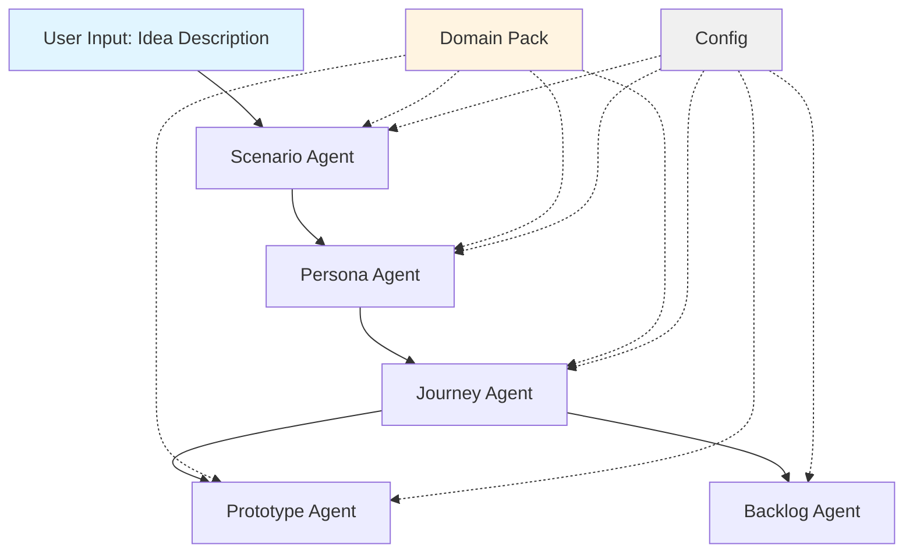

# Architecture

## System Overview

Product Discovery Copilot is a TypeScript/Node.js application that orchestrates an end-to-end product discovery workflow using the GitHub Copilot SDK.



## Component Architecture

### Core Components

#### 1. Config (`config.ts`)
- Manages application configuration
- Loads domain packs
- Handles terminology and compliance rules
- Provides logging capabilities

#### 2. Agents (`agent/`)

**Scenario Agent** (`scenario-agent.ts`)
- Input: Raw idea description
- Output: Structured scenario + problem statement
- Uses domain terminology for appropriate language

**Persona Agent** (`persona-agent.ts`)
- Input: Scenario
- Output: 3-6 evidence-based personas
- Exports to JSON matching existing schema

**Journey Agent** (`journey-agent.ts`)
- Input: Scenario + Personas
- Output: User journeys with Mermaid diagrams
- Suggests 5-8 journeys, generates detailed documentation

**Prototype Agent** (`prototype-agent.ts`)
- Input: User journey
- Output: Prototype page definitions
- Uses domain-specific design systems

**Backlog Agent** (`backlog-agent.ts`)
- Input: User journey
- Output: GitHub Issues (epics, stories, tasks)
- Structures backlog items hierarchically

### Domain Packs

Domain packs are modular configurations stored in `domain-packs/`:

```
domain-packs/
├── nhs/
│   ├── design-system.json    # NHS App components & colors
│   ├── terminology.json       # Healthcare terminology
│   └── compliance-rules.md    # GDPR, clinical safety, etc.
├── govuk/
│   ├── design-system.json    # GOV.UK Design System
│   ├── terminology.json       # Government terminology
│   └── compliance-rules.md    # Service Standard, accessibility
└── financial-services/
    ├── design-system.json    # Custom design system
    ├── terminology.json       # Financial terminology
    └── compliance-rules.md    # FCA regulations, AML, KYC
```

## Data Flow

1. **Configuration Loading**: System loads selected domain pack
2. **Scenario Generation**: AI generates structured scenario using domain terminology
3. **Persona Creation**: AI creates personas relevant to domain context
4. **Journey Design**: AI suggests and details user journeys
5. **Prototype Generation**: Creates UI pages using domain design system
6. **Backlog Creation**: Transforms journeys into actionable GitHub Issues

## Technology Stack

- **Language**: TypeScript 5.x
- **Runtime**: Node.js 20.x
- **AI Engine**: GitHub Copilot SDK
- **Testing**: Jest
- **Build**: TypeScript Compiler

## Extensibility

### Adding New Agents

1. Create new agent in `src/agent/`
2. Implement agent interface
3. Add to main orchestrator in `index.ts`
4. Write unit tests

### Adding New Domain Packs

1. Create directory in `src/domain-packs/`
2. Add required JSON and MD files
3. Test with existing agents
4. Add domain-specific tests

## Security Considerations

- Domain packs may contain sensitive compliance information
- AI-generated content should be reviewed before production use
- Ensure appropriate data handling per domain regulations
- Follow principle of least privilege for file system access

## Performance

- Domain packs are cached after first load
- Streaming responses supported for real-time feedback
- Agents can run independently for parallel processing

## Future Enhancements

- Real GitHub Copilot SDK integration
- Streaming UI for live generation
- Multi-language support
- Custom agent extensions
- Cloud deployment options
